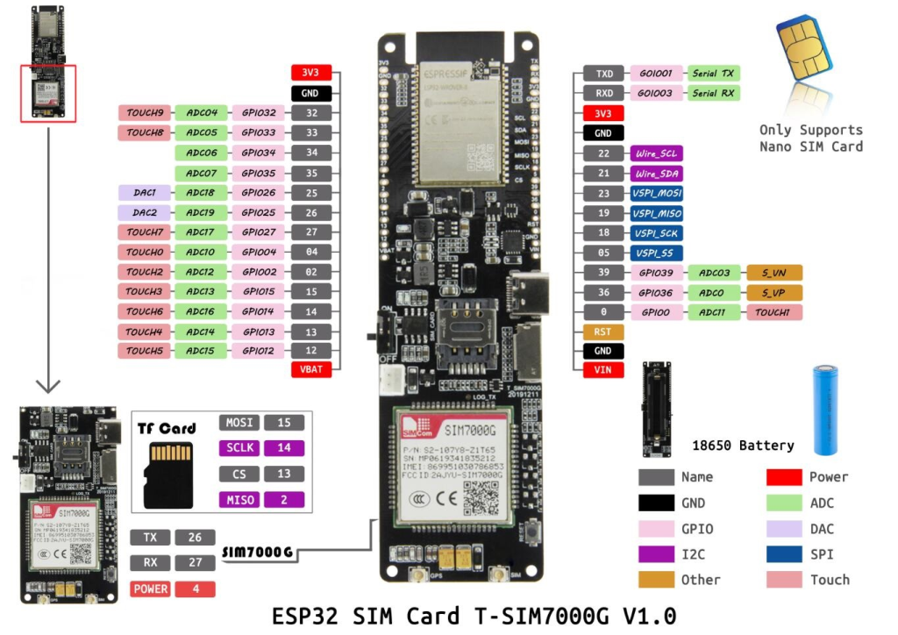

# TrackOn 

### PinOut

  
 ## SIM7000G connection
| Name      | Pins |
| --------- | ---- |
| PIN_RX    | 26   |
| PIN_TX    | 27   |
| PWR_PIN   | 4    |
| BAT_ADC   | 35   |
| SOLAR_ADC | 36   |
| SD MISO   | 2    |
| SD MOSI   | 15   |
| SD CLK    | 14   |
| SD CS     | 13   |

